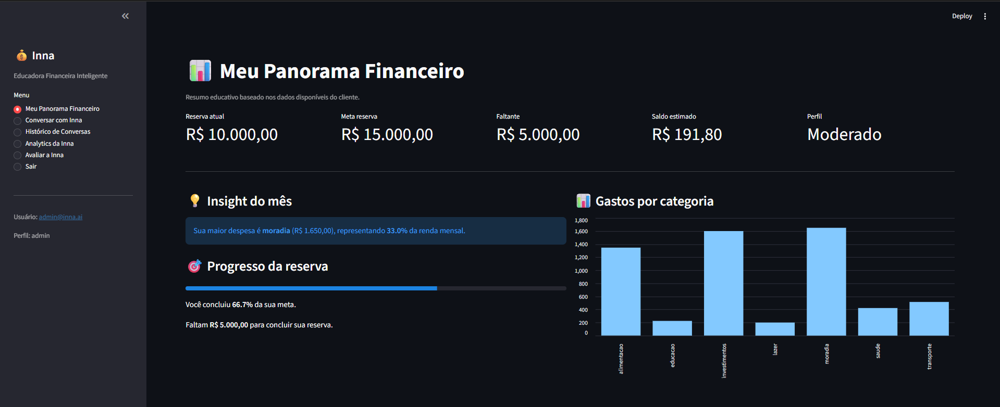
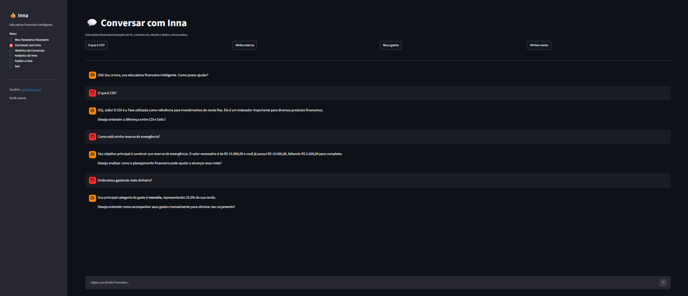
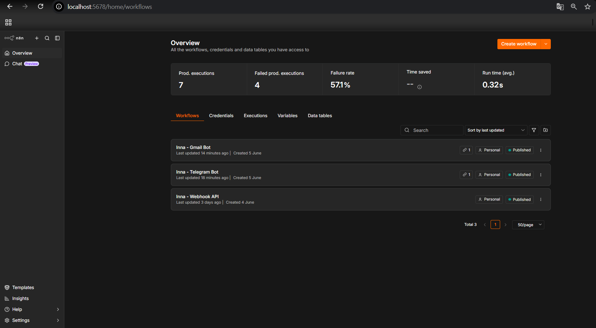
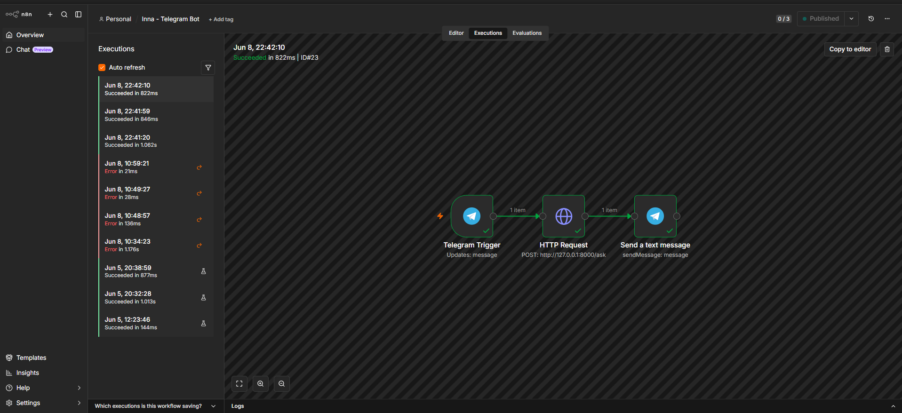
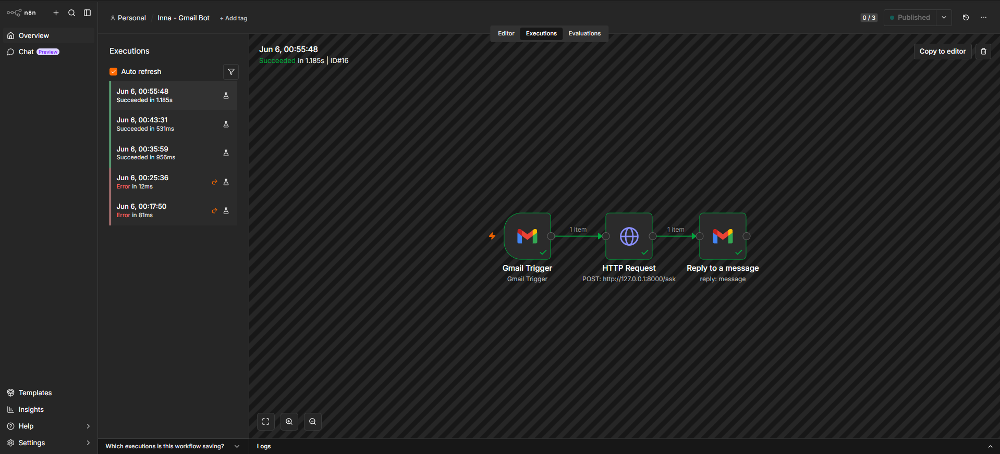
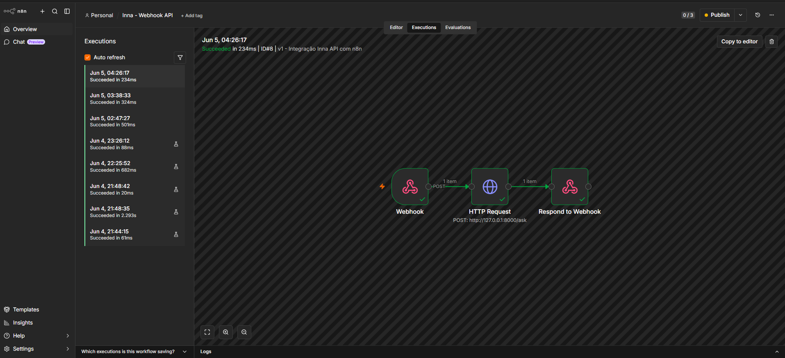
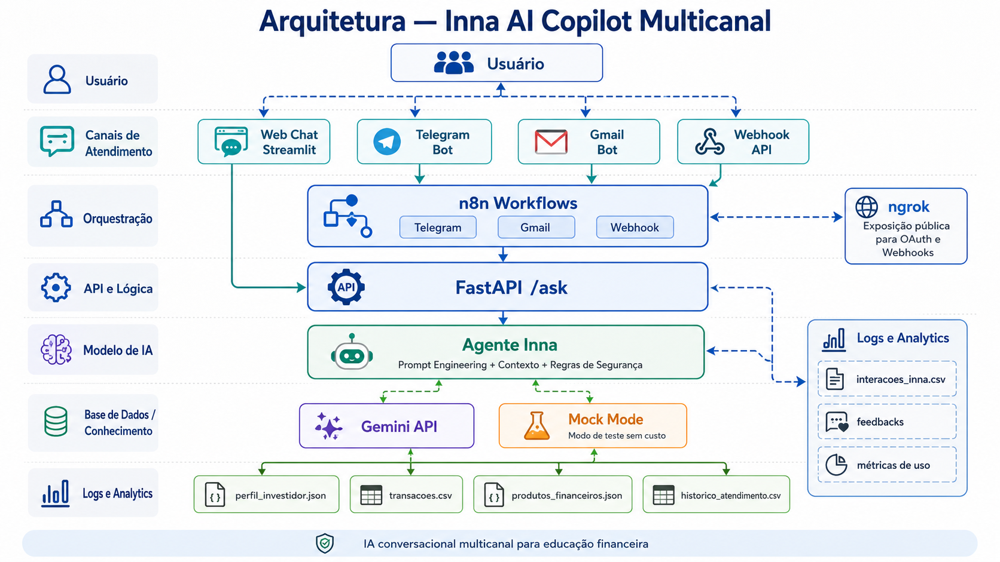

# Inna AI Copilot Multichannel
Educadora Financeira Inteligente com IA Generativa, FastAPI, Streamlit, n8n, Telegram, Gmail e Webhook API

A **Inna** é uma assistente financeira inteligente multicanal desenvolvida para explicar conceitos de finanças pessoais de forma simples, segura e contextualizada.

O projeto combina IA Generativa, Prompt Engineering, FastAPI, Streamlit, n8n, Telegram Bot, Gmail Bot, Webhook API, logs unificados e analytics para demonstrar uma solução prática de IA Conversacional aplicada à educação financeira.

---


---

## 🏅 Badges
- 📦 Tamanho do repositório  
  
- 📄 Licença do projeto  
  

---

## 📋 Índice
📖 Descrição  
🎯 Problema Resolvido  
💡 Solução  
🚧 Status  
🧩 Funcionalidades  
🖼️ Demonstração Visual  
🏗️ Arquitetura  
🧰 Tecnologias  
📂 Estrutura do Projeto  
📊 Dados Utilizados  
🔐 Segurança e Limitações  
⚙️ Configuração  
▶️ Como Rodar  
🔄 Integração com n8n  
📈 Logs e Analytics  
🧪 Testes  
📚 Documentação Técnica  
🚀 Roadmap  
👨‍💻 Desenvolvedor
📜 Licença  
🏁 Conclusão  

---

## 📖 Descrição
A Inna AI Copilot Multichannel é um MVP funcional de agente conversacional financeiro.  
Ela explica conceitos como CDI, Selic, reserva de emergência, organização de gastos, metas financeiras, renda fixa, perfil financeiro e planejamento pessoal.  
⚠️ **Importante:** A Inna não faz recomendação de investimentos, apenas explica conceitos de forma educativa.

---

## 🎯 Problema Resolvido
- Dificuldade das pessoas em entender finanças pessoais.  
- Chatbots financeiros genéricos, sem contexto ou métricas.  

Este projeto resolve criando uma assistente que:  
- Explica conceitos com linguagem simples.  
- Usa dados fictícios de cliente demo.  
- Atende por múltiplos canais.  
- Registra logs e gera analytics.  

---

## 💡 Solução
Fluxo principal:  
Usuário → Streamlit / Telegram / Gmail / Webhook → n8n → FastAPI → Agente Inna → Gemini ou Mock Mode → Logs e Analytics  

Integra:  
- Backend Python  
- IA Generativa  
- Automação low-code  
- Canais conversacionais  
- Logs e métricas  

---

## 🚧 Status
✅ MVP funcional em desenvolvimento avançado  

| Módulo | Status |
|--------|--------|
| Web Chat Streamlit | ✅ |
| FastAPI /ask | ✅ |
| Gemini API | ✅ |
| Mock Mode | ✅ |
| Telegram Bot via n8n | ✅ |
| Gmail Bot via n8n | ✅ |
| Webhook API via n8n | ✅ |
| Logs unificados | ✅ |
| Analytics inicial | ✅ |
| RAG | 🧪 Estrutura inicial |
| PostgreSQL | 🔜 Roadmap |
| WhatsApp | 🔜 Roadmap |
| Power BI | 🔜 Roadmap |
| Deploy em Cloud | 🔜 Roadmap |

---

## 🧩 Funcionalidades
- 💬 Chat com IA (Streamlit)  
- 📊 Panorama financeiro (reserva, saldo, perfil, gastos)  
- 🤖 Gemini API para respostas reais  
- 🧪 Mock Mode para testes  
- ⚡ FastAPI endpoint `/ask`  
- 🔁 n8n para orquestração  
- 📲 Telegram Bot  
- 📧 Gmail Bot  
- 🌐 Webhook API  
- 🧾 Logs unificados  
- 📈 Analytics iniciais  
- ⭐ Feedbacks dos usuários  
- 🔐 Segurança contra recomendações financeiras  
- 🧠 Estrutura inicial de RAG  

---

## 🖼️ Demonstração Visual

### Interface Web — Streamlit

Painel financeiro com dados do cliente demo, reserva de emergência, saldo estimado, perfil e gastos por categoria.



---

### Demonstração do Agente

Conversa com a Inna respondendo perguntas sobre CDI, reserva de emergência e análise de gastos.



---

### Workflows Publicados no n8n

Visão geral dos workflows publicados para Telegram, Gmail e Webhook API.



---

### Fluxo Telegram

Workflow responsável por receber mensagens do Telegram, enviar para a API FastAPI e retornar a resposta ao usuário.



---

### Fluxo Gmail

Workflow responsável por receber e-mails, enviar a dúvida para a API da Inna e responder automaticamente pelo Gmail.



---

### Fluxo Webhook API

Workflow que permite integração com sistemas externos por meio de Webhook.



---

## 🏗️ Arquitetura

A arquitetura atual foi pensada para ser simples, funcional e preparada para evolução.



--- 

---

## 🧰 Tecnologias
- **Linguagem:** Python  
- **Interface:** Streamlit  
- **API:** FastAPI  
- **IA Generativa:** Gemini API  
- **Automação:** n8n  
- **Canais:** Telegram, Gmail, Webhook  
- **Dados:** CSV, JSON  
- **Analytics:** Pandas, Plotly  
- **Testes:** Pytest  
- **Configuração:** dotenv  
- **Versionamento:** Git/GitHub  
- **Roadmap:** PostgreSQL, RAG, Power BI, OCI Cloud  

---

## 📂 Estrutura do Projeto

inna-ai-copilot/
├── api/
├── assets/
├── data/
├── docs/
├── rag/
├── src/
├── tests/
└── README.md

---

## 📊 Dados Utilizados
- `perfil_usuario.json` → Perfil fictício  
- `transacoes.csv` → Transações simuladas  
- `interacoes_inna.csv` → Logs de atendimento  
- `feedbacks.csv` → Avaliações dos usuários  

---

## 🔐 Segurança e Limitações

A Inna foi projetada para atuar como educadora financeira, não como consultora de investimentos.

A assistente:

Não recomenda compra ou venda de ativos;
Não promete rentabilidade;
Não acessa dados bancários reais;
Não solicita senhas;
Não substitui profissional certificado;
Utiliza dados fictícios para demonstração;
Explica conceitos financeiros de forma educativa;
Informa limitações quando não possui contexto suficiente.

---

## ⚙️ Configuração

O projeto utiliza .env para variáveis locais e .env.example como modelo seguro para o GitHub.

Exemplo:
```
APP_NAME=inna-ai-copilot-multichannel
APP_VERSION=1.0.0
APP_ENV=development

INNA_APP_NAME=Inna - Educadora Financeira Inteligente
INNA_NOME=Inna
INNA_TITULO=Educadora Financeira Inteligente
INNA_MOCK_MODE=true

GEMINI_API_KEY=coloque_sua_chave_gemini_aqui
GEMINI_MODEL=gemini-2.5-flash-lite

API_HOST=127.0.0.1
API_PORT=8000
API_BASE_URL=http://127.0.0.1:8000
```
O arquivo .env real não deve ser enviado para o GitHub

---


---

## ▶️ Como Rodar

1. Clonar o repositório
git clone https://github.com/Rogerio5/inna-ai-copilot-multichannel.git
cd inna-ai-copilot-multichannel
2. Criar ambiente virtual
python -m venv .venv
3. Ativar ambiente virtual

Windows PowerShell:

.\.venv\Scripts\Activate.ps1
4. Instalar dependências
pip install -r requirements.txt
5. Configurar .env
copy .env.example .env

Depois, preencha as variáveis necessárias.

6. Rodar a API FastAPI
python -m uvicorn api.main:app --reload --port 8000

A API ficará disponível em:

http://127.0.0.1:8000
7. Rodar o Streamlit

Em outro terminal:

streamlit run src/app.py --server.port 8501

A interface ficará disponível em:

http://localhost:8501

---

## 🔄 Integração com n8n
Workflows:  
- Telegram Bot  
- Gmail Bot  
- Webhook API  

Fluxo geral:

Canal externo → n8n → FastAPI /ask → Agente Inna → n8n → resposta ao usuário

Durante o desenvolvimento local, o ngrok pode ser usado para expor o n8n:

ngrok http 5678

---

## 📈 Logs e Analytics

 As interações são registradas em:

data/interacoes_inna.csv

Campos principais:
```
data_hora
canal
usuario_id
usuario
assistente
pergunta
resposta
status
tempo_resposta_segundos
```
Esses dados permitem acompanhar:
```
Total de interações;
Canais utilizados;
Tempo médio de resposta;
Taxa de sucesso;
Erros;
Usuários atendidos;
Perguntas frequentes;
Temas mais buscados;
Base futura para Power BI.
```
---

## 🧪 Testes

O projeto possui estrutura inicial de testes com Pytest.
Executar com:  

pytest

---

## 📚 Documentação Técnica

### 📚 Documentação Técnica

A documentação detalhada está disponível na pasta `docs/`. Cada arquivo descreve aspectos específicos do agente e da arquitetura.

| **Arquivo** | **Conteúdo** |
|-------------|---------------|
| 01-documentacao-agente.md | Caso de uso; persona; tom de voz; regras de segurança |
| 02-base-conhecimento.md | Dados utilizados; contexto do agente; exemplos de dados |
| 03-prompts.md | System Prompt; exemplos de prompts; edge cases |
| 04-metricas.md | Métricas de avaliação; KPIs; procedimentos de teste |
| 05-pitch.md | Roteiro executivo; resumo para apresentação |
| arquitetura.md | Arquitetura atual; diagrama; plano de evolução |

---

## 🚀 Roadmap — Projeto 2

**Inna Cloud AI Platform**  
Uma plataforma multicanal de IA Conversacional com memória, cloud, automação e analytics.

### Objetivo
Evoluir o MVP para uma plataforma escalável, com persistência de dados, observabilidade e integração com canais e ferramentas empresariais.

### Evoluções futuras
- **Deploy em OCI**  
- **n8n rodando 24/7**  
- **PostgreSQL** para logs, usuários, feedbacks e transações  
- **Memória persistente por `usuario_id`**  
- **WhatsApp** como canal oficial  
- **RAG** com base documental financeira  
- **Power BI** conectado ao banco para dashboards executivos  
- **Dashboards executivos** para métricas de negócio e operação  
- **Observabilidade e monitoramento** (logs, métricas, alertas)  
- **Possível integração com OCI Generative AI**  
- **Arquitetura escalável** para múltiplos usuários e alta disponibilidade

### Marcos propostos
1. Provisionamento e deploy em cloud (OCI).  
2. Migração de logs para PostgreSQL e modelagem de dados.  
3. Implementação de memória por usuário e persistência de sessão.  
4. Integração oficial com WhatsApp via provedor compatível.  
5. Implementação de RAG e enriquecimento da base documental.  
6. Conexão com Power BI e criação de dashboards iniciais.  
7. Hardening de segurança, observabilidade e testes de carga.  
8. Lançamento da plataforma Inna Cloud AI (beta público).

### Indicadores de sucesso (KPIs)
- Tempo médio de resposta por canal  
- Taxa de sucesso nas respostas (feedback positivo)  
- Número de usuários ativos mensais  
- Latência média da API  
- Disponibilidade (uptime) da plataforma  
- Volume de consultas atendidas por dia

---

## 👨‍💻 Desenvolvedor
- [Rogerio](https://github.com/Rogerio5)

---

## 📜 Licença
MIT License  

---

## 🏁 Conclusão
A Inna AI Copilot Multichannel demonstra como aplicar IA Generativa em educação financeira, integrando interface web, API, automação low-code, canais externos, logs e analytics.  
Mais que um chatbot, é um MVP preparado para evoluir em plataforma cloud com PostgreSQL, RAG, Power BI, WhatsApp e memória persistente.
