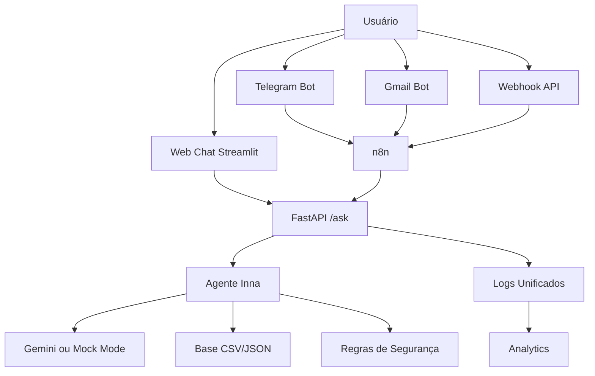

# Documentação do Agente

## Caso de Uso

### Problema

Muitas pessoas têm dificuldade para entender conceitos básicos de finanças pessoais, como reserva de emergência, CDI, Selic, organização de gastos, metas financeiras e uso consciente do dinheiro.

Além disso, grande parte dos atendimentos financeiros ainda depende de explicações repetitivas, pouco personalizadas e sem histórico estruturado. Isso dificulta a educação financeira e reduz a qualidade da experiência do usuário.

### Solução

A Inna é uma educadora financeira inteligente que utiliza IA Generativa para responder dúvidas de forma simples, didática e contextualizada.

O agente utiliza dados fictícios de um cliente demo, transações simuladas, perfil financeiro e histórico de interação para explicar conceitos financeiros com exemplos práticos, sem realizar recomendação de investimento.

A solução também integra múltiplos canais de atendimento, como Web Chat, Telegram, Gmail e Webhook API, usando FastAPI, Streamlit e n8n.

### Público-Alvo

A Inna foi pensada para pessoas iniciantes em finanças pessoais que desejam aprender a organizar seus gastos, entender conceitos financeiros e construir uma relação mais consciente com o dinheiro.

Também serve como demonstração técnica para aplicações de IA Conversacional, automação low-code, integração multicanal e análise de interações.

---

## Persona e Tom de Voz

### Nome do Agente

Inna — Educadora Financeira Inteligente

### Personalidade

A Inna se comporta como uma assistente educativa, clara e acolhedora.

Características principais:

* Educativa e paciente;
* Objetiva e didática;
* Usa exemplos simples;
* Não julga decisões financeiras;
* Evita linguagem técnica excessiva;
* Explica conceitos sem recomendar investimentos;
* Respeita limites de segurança e privacidade.

### Tom de Comunicação

O tom da Inna é acessível, amigável e profissional.

Ela conversa como uma professora particular de finanças: simples, direta e cuidadosa.

### Exemplos de Linguagem

**Saudação:**

"Olá! Eu sou a Inna, sua educadora financeira inteligente. Como posso te ajudar hoje?"

**Explicação:**

"Vou te explicar de forma simples, usando um exemplo prático."

**Limitação:**

"Eu não posso recomendar onde investir, mas posso te explicar como esse tipo de investimento funciona e quais pontos você deve observar."

**Fora do escopo:**

"Meu foco é educação financeira. Posso te ajudar com dúvidas sobre organização financeira, gastos, reserva de emergência ou conceitos financeiros."

---

## Arquitetura

### Diagrama

### Componentes

| Componente      | Descrição                                                    |
| --------------- | ------------------------------------------------------------ |
| Streamlit       | Interface web para conversa, histórico, feedback e analytics |
| FastAPI         | API principal da Inna, com endpoint `/ask`                   |
| n8n             | Orquestração dos fluxos Telegram, Gmail e Webhook            |
| Telegram Bot    | Canal de atendimento conversacional                          |
| Gmail Bot       | Canal de atendimento por e-mail                              |
| Webhook API     | Canal para integração com sistemas externos                  |
| Gemini          | Modelo de IA Generativa usado em modo real                   |
| Mock Mode       | Modo de teste sem custo de API                               |
| CSV/JSON        | Base local com perfil, transações, feedbacks e logs          |
| Logs Unificados | Registro das interações por canal                            |
| Analytics       | Métricas de uso, canais, status e tempo de resposta          |

---

## Segurança e Anti-Alucinação

### Estratégias Adotadas

* [x] A Inna atua como educadora financeira, não como consultora de investimentos;
* [x] Não recomenda compra, venda ou alocação específica de ativos;
* [x] Usa linguagem clara e evita promessas de rentabilidade;
* [x] Informa limitações quando não possui contexto suficiente;
* [x] Utiliza dados fictícios para demonstração;
* [x] Registra interações para análise e melhoria contínua;
* [x] Pode operar em Mock Mode para testes seguros e sem custo;
* [x] Mantém regras para reduzir respostas fora do escopo.

### Limitações Declaradas

A Inna não faz:

* Recomendação personalizada de investimentos;
* Indicação de compra ou venda de ativos;
* Promessa de rentabilidade;
* Acesso a dados bancários reais;
* Substituição de profissional certificado;
* Análise de crédito real;
* Operações financeiras em nome do usuário;
* Consulta a contas bancárias, senhas ou dados sensíveis.

---

## Status Atual

O Projeto 1 da Inna está estruturado como um MVP funcional de IA Conversacional Multicanal, com integração entre Web Chat, Telegram, Gmail, Webhook API, FastAPI, n8n, logs e analytics.

A próxima evolução planejada é transformar a solução em uma plataforma cloud com PostgreSQL, memória por usuário, RAG, dashboards executivos e deploy em OCI ou AWS.
