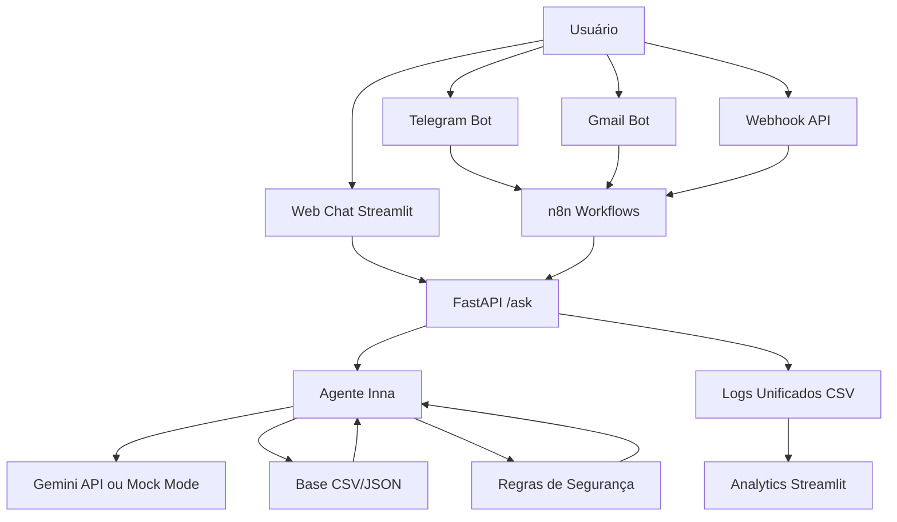
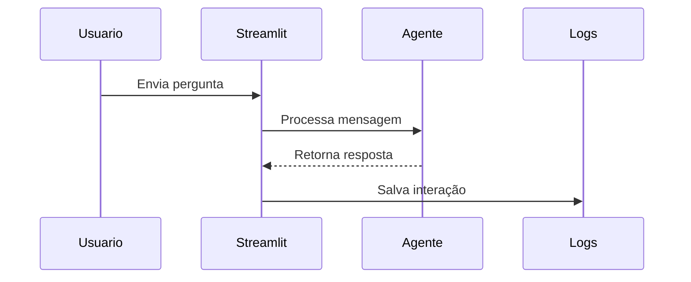
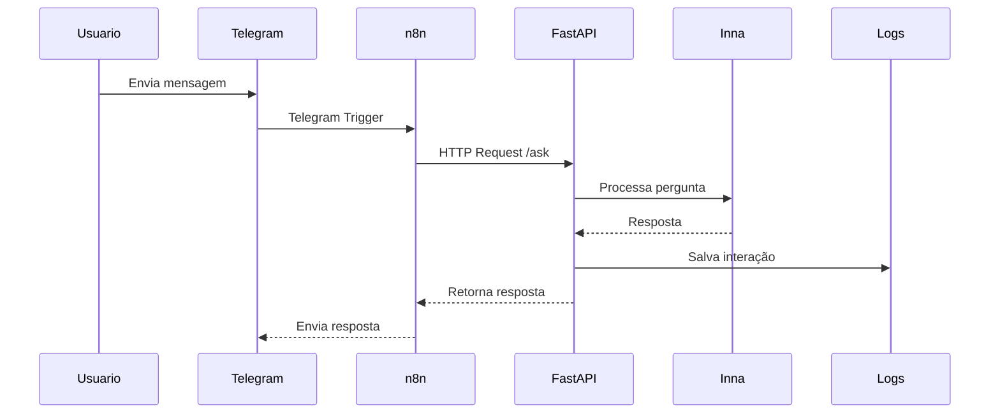
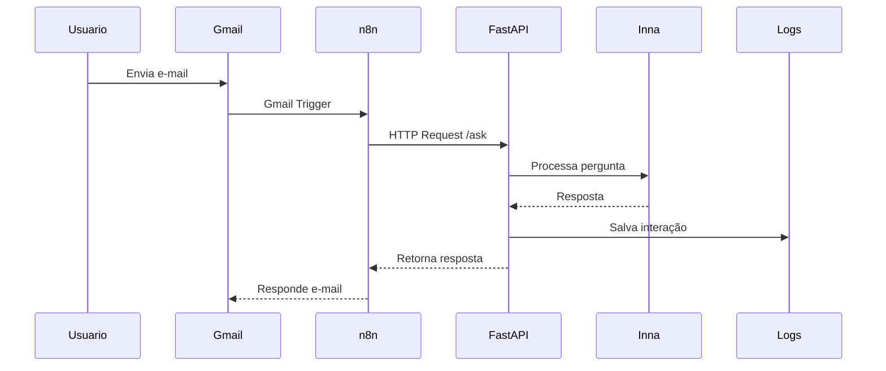
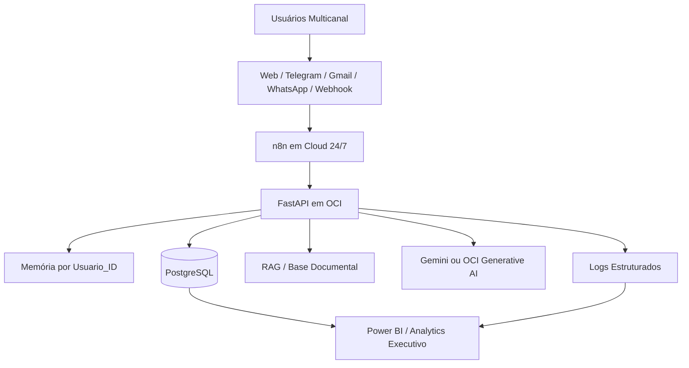

# Arquitetura — Inna AI Copilot Multicanal

## Visão Geral

A Inna AI Copilot Multicanal é uma solução de IA Conversacional aplicada à educação financeira.

A arquitetura foi desenhada para integrar diferentes canais de atendimento a uma API central, permitindo que a Inna responda usuários via Web Chat, Telegram, Gmail e Webhook API.

O projeto utiliza uma abordagem modular, com separação entre interface, automação, API, agente de IA, dados e analytics.

---

## Arquitetura Atual — Projeto 1



---

## Fluxo de Atendimento

### 1. Web Chat



### 2. Telegram



### 3. Gmail



---

## Componentes da Solução

| Camada        | Tecnologia         | Função                                        |
| ------------- | ------------------ | --------------------------------------------- |
| Interface Web | Streamlit          | Web Chat, analytics, histórico e feedback     |
| API           | FastAPI            | Endpoint central `/ask`                       |
| IA            | Gemini / Mock Mode | Geração de respostas                          |
| Automação     | n8n                | Orquestra Telegram, Gmail e Webhook           |
| Dados         | CSV/JSON           | Perfil fictício, transações, logs e feedbacks |
| Logs          | CSV                | Registro de interações multicanal             |
| Analytics     | Streamlit          | Métricas iniciais da Inna                     |
| Segurança     | Prompt Engineering | Regras de escopo e não recomendação           |
| RAG           | Estrutura inicial  | Evolução para base documental                 |

---

## Estrutura de Canais

| Canal              | Status       | Descrição                            |
| ------------------ | ------------ | ------------------------------------ |
| Web Chat Streamlit | Implementado | Interface principal do usuário       |
| Telegram Bot       | Implementado | Atendimento via Telegram usando n8n  |
| Gmail Bot          | Implementado | Atendimento por e-mail usando n8n    |
| Webhook API        | Implementado | Integração com sistemas externos     |
| WhatsApp           | Roadmap      | Canal planejado para evolução futura |

---

## Dados e Logs

A Inna registra as interações em `data/interacoes_inna.csv`.

Campos principais:

```text
data_hora
canal
usuario_id
usuario
assistente
pergunta
resposta
status
tempo_resposta_segundos
```

Esses dados permitem:

* Acompanhar uso por canal;
* Medir tempo médio de resposta;
* Identificar erros;
* Avaliar perguntas frequentes;
* Criar dashboards executivos;
* Evoluir para banco PostgreSQL.

---

## Segurança e Governança

A arquitetura da Inna inclui regras para reduzir riscos de alucinação e uso indevido:

* Não recomenda investimentos;
* Não promete rentabilidade;
* Não acessa dados bancários reais;
* Usa dados fictícios para demonstração;
* Informa limitações quando necessário;
* Mantém foco em educação financeira;
* Registra interações para análise futura.

---

## Arquitetura Futura — Projeto 2

O Projeto 2, chamado **Inna Cloud AI Platform**, será a evolução cloud da solução.



### Evoluções planejadas

* Deploy em OCI;
* n8n rodando 24/7;
* PostgreSQL para usuários, logs, feedbacks e transações;
* Memória persistente por `usuario_id`;
* WhatsApp como canal oficial;
* RAG com base documental financeira;
* Power BI conectado ao banco;
* Dashboards executivos;
* Monitoramento e observabilidade;
* Possível integração com OCI Generative AI.

---

## Decisão Arquitetural

O Projeto 1 foi construído como MVP funcional, priorizando simplicidade, integração real e validação rápida.

A escolha por CSV/JSON permite desenvolvimento local, baixo custo e fácil entendimento.

A evolução para PostgreSQL, Cloud e RAG será feita no Projeto 2, mantendo a mesma lógica central da Inna e substituindo camadas simples por componentes mais robustos.

---

## Resumo Executivo da Arquitetura

A Inna conecta usuários a uma API de IA por múltiplos canais, utiliza automação com n8n, aplica regras de segurança por prompt engineering, registra logs unificados e prepara dados para analytics.

Essa arquitetura demonstra domínio de IA Conversacional, automação low-code, backend Python, integração com APIs e visão de evolução cloud.
